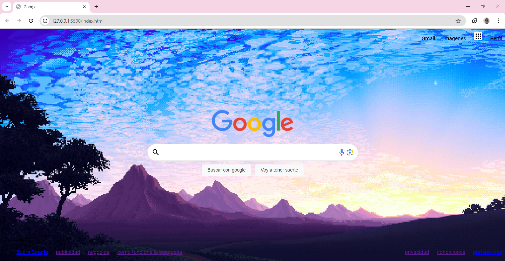

# Mi portafolio de Technolochicas PRO

Este proyecto implicó la creación de un sitio web que imita la apariencia de Google. Esto incluyó el diseño  y la presentación de contenido similar.

 Tecnologías
* HTML
* CSS
* Bootstrap 5

[Proyecto en linea](https://glondegoogle.netlify.app/)

- Capturas de pantalla

* Sección de inicio.

- Créditos

* Agradezco al curso de Technolochicas PRO